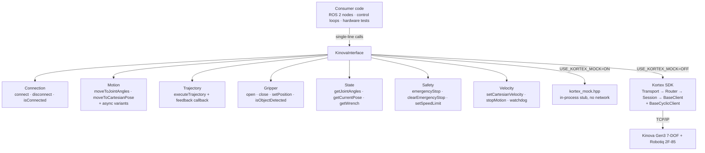

# kinova_wrapper

A C++17 wrapper around the Kinova Kortex SDK for the Gen3 7-DOF arm and Robotiq 2F-85 gripper, packaged as an `ament_cmake` ROS 2 package.

It replaces the SDK's manual resource management and protobuf boilerplate with RAII-owned connections, mutex-protected calls, validated inputs, and a compile-time mock that lets the whole package build and be unit-tested with no robot attached.

| | |
|---|---|
| **Package** | `kinova_wrapper` v0.1.0 |
| **Build system** | `ament_cmake` (ROS 2, colcon) |
| **Language** | C++17 |
| **Target** | Kinova Gen3 7-DOF + Robotiq 2F-85, over TCP/IP (default `192.168.1.10:10000`) |
| **License** | MIT |
| **Maintainer** | Sahil Narola — Advanced Biomechatronics and Locomotion Lab, Carleton University |

---

## Scope

This package is a **thin, safe transport layer to the arm**. It deliberately does not contain robot math or control law.

**In this package**

- Connection lifecycle (transport → router → session → base client) with RAII teardown
- Blocking and async joint / Cartesian motion
- Multi-waypoint joint trajectory execution with a progress callback
- Gripper position control and stall-based object detection
- State reads: joint angles, end-effector pose, wrench
- Emergency stop, joint-limit validation, workspace bounds, velocity clamping, command watchdog
- A mock Kortex SDK (`mock/kortex_mock.hpp`) for hardware-free builds and CI

**Not in this package**

| Concern | Lives in |
|---|---|
| FK / IK / Jacobian / DH chain | `kinova_kinematics` |
| Admittance control, force loops | `admittance_controller` |
| External MAE F/T sensor driver | separate sensor package (this package never reads the MAE sensor) |
| ROS 2 lifecycle node, action servers | downstream nodes that link this library |
| 1 kHz low-level cyclic servoing | not implemented here — see [Performance](#performance-and-limits) |

---

## The problem this solves

A single "connect and move" sequence in raw Kortex is roughly 60 lines of manual `new`/`delete`, protobuf assembly, and servoing-mode setup, with no error handling — and every resource leaks if any step in the middle throws.

```cpp
KinovaInterface kinova;
if (!kinova.connect("192.168.1.10")) return 1;

kinova.moveToJointAngles({0, 0.26, 0, -1.05, 0, -0.78, 0});   // radians
kinova.closeGripper();

if (kinova.isObjectDetected()) {
    // gripper stalled before full closure → object in hand
}
// destructor joins the watchdog thread and tears down the SDK objects
// in reverse creation order, including on exception unwind
```

Every public call is input-validated, mutex-protected, and returns `false` (or an empty/default value) instead of throwing.

---

## Architecture



### Ownership and teardown

SDK objects are held in `std::unique_ptr` and created in dependency order: `TransportClientTcp` → `RouterClient` → `SessionManager` → `BaseClient` (→ `BaseCyclicClient`, hardware builds only). Teardown runs in exact reverse. If any creation step fails, `connect()` unwinds everything already built and returns `false`. The destructor stops and joins the watchdog thread **before** disconnecting.

The class is non-copyable and non-movable: it owns a hardware connection, a mutex, and a thread.

### Threading model

| Mechanism | Protects |
|---|---|
| `mutex_` | every Kortex SDK call and the joint-limit tables |
| `velocity_time_mutex_` | `last_velocity_time_` timestamp shared with the watchdog thread |
| `std::atomic<bool> connected_` | lock-free connection pre-check |
| `std::atomic<bool> e_stop_active_` | lock-free e-stop gate, set *before* the SDK call |
| `std::atomic<bool> velocity_active_` | lock-free velocity-mode flag read by the watchdog |
| `std::atomic<bool> watchdog_running_` | thread exit signal |

Public methods acquire `mutex_`; private helpers (`disconnectLocked`, `validateJointAngles`, `validateTrajectory`) assume it is already held and never lock, which keeps the lock non-recursive.

Long blocking waits release the lock first: `moveToJointAngles` and `moveToCartesianPose` unlock `mutex_` before waiting on the action-completion notification, and `executeTrajectory` unlocks before the waypoint loop, so state reads from other threads are not blocked during motion.

### Units at the API boundary

| Quantity | Public API | Sent to Kortex |
|---|---|---|
| Joint angles | **radians** | degrees (converted in-method) |
| Pose position | **meters** | meters |
| Pose orientation | **degrees** (`theta_x/y/z`, Kortex Euler convention) | degrees, passed through |
| Linear velocity | **m/s** | m/s |
| Angular velocity | **deg/s** | deg/s, passed through |
| Gripper position | **normalized 0.0 = open → 1.0 = closed** | same |
| Wrench | N and N·m | — |

Angular velocity is the one deviation from the radians-at-the-boundary rule: `setCartesianVelocity` takes deg/s because Kortex `SendTwistCommand` expects deg/s, and the value is forwarded unconverted. Callers working in rad/s must convert at the call site.

---

## Requirements

- C++17 compiler (GCC 11+ or Clang)
- CMake ≥ 3.16
- ROS 2 with `ament_cmake` (developed on Jazzy / Ubuntu 24.04)
- `ament_cmake_gtest` (unit tests)
- Kortex C++ SDK — **hardware builds only**
- `kinova_kinematics` and Eigen 3 — **hardware builds only** (required by the FK/IK hardware test, not by the library itself)

---

## Build

The package is `ament_cmake`, so build it with colcon from the workspace root — not a bare `cmake ..`.

### Mock build (no hardware, default)

```bash
colcon build --packages-select kinova_wrapper
```

`USE_KORTEX_MOCK` defaults to **ON**. The library compiles against `mock/kortex_mock.hpp`, links no SDK, and needs no network.

### Hardware build

```bash
colcon build --packages-select kinova_wrapper \
  --cmake-args -DUSE_KORTEX_MOCK=OFF
```

**Forgetting `-DUSE_KORTEX_MOCK=OFF` is the single most common failure mode:** the code compiles and runs cleanly against the mock and silently never touches the robot.

CMake locates the SDK via `KORTEX_DIR`, resolved in this order:

1. the `KORTEX_DIR` environment variable, if set
2. otherwise `$HOME/kinova_learning/kortex/api_cpp/examples/kortex_api`
3. override explicitly with `-DKORTEX_DIR=/path/to/kortex_api`

The build fails fast with a `FATAL_ERROR` if `${KORTEX_DIR}/lib/release/libKortexApiCpp.a` is missing, rather than failing later at link time.

### Hardware bring-up checklist

1. Arm powered and reachable at `192.168.1.10`.
2. Re-add the host route to the arm after every reboot — it does not persist. On the lab PC this is the netplan route to `192.168.1.10` via `enp6s0f3`; the interface name is machine-specific.
3. Build with `-DUSE_KORTEX_MOCK=OFF`.
4. Verify with a hardware test before running any control loop.

---

## API

```cpp
namespace kinova_wrapper {

struct Pose {
    double x, y, z;                     // meters
    double theta_x, theta_y, theta_z;   // degrees (Kortex Euler convention)
};

struct TrajectoryPoint {
    std::vector<double> joint_angles;   // radians, exactly 7
    double time_from_start;             // seconds from trajectory start
};

using MotionCallback = std::function<void(
    const std::vector<double>& current_joints,   // radians
    double progress)>;                           // 0.0 → 1.0
}
```

### Connection

| Method | Returns | Notes |
|---|---|---|
| `connect(ip, port = 10000, user = "admin", pass = "admin")` | `bool` | Idempotent — disconnects first if already connected. Hardware builds set 60 s session / 2 s connection inactivity timeouts explicitly. |
| `disconnect()` | `void` | Safe to call repeatedly and when not connected. Never throws. |
| `isConnected() const` | `bool` | Lock-free atomic read. |

### Motion

| Method | Returns | Rejects when |
|---|---|---|
| `moveToJointAngles(angles)` | `bool` | not connected · e-stop active · size ≠ 7 · outside joint limits · 30 s timeout · robot aborts the action |
| `moveToJointAnglesAsync(angles)` | `std::future<bool>` | same — **store the future**; discarding it makes the destructor block immediately |
| `moveToCartesianPose(pose)` | `bool` | not connected · e-stop active · 30 s timeout · robot aborts (unreachable pose) |
| `moveToCartesianPoseAsync(pose)` | `std::future<bool>` | same |

Both async variants capture arguments **by value** into the `std::async` lambda, so a caller's vector going out of scope cannot dangle.

### Trajectory

| Method | Returns | Notes |
|---|---|---|
| `executeTrajectory(waypoints, cb = nullptr)` | `bool` | Waypoint-by-waypoint execution, **not** interpolated — the arm's internal controller smooths between points. Dwell between waypoints is the delta of consecutive `time_from_start`. |
| `executeTrajectoryAsync(waypoints, cb = nullptr)` | `std::future<bool>` | Captures waypoints and callback by value. |

Validation rejects: empty lists, negative first timestamp, non-monotonic or duplicate timestamps, and any waypoint failing joint-limit validation. The loop re-checks `e_stop_active_` before every waypoint, so an e-stop raised from another thread aborts mid-trajectory. The callback fires **after** each waypoint with the measured joint angles and a progress fraction.

### Gripper (Robotiq 2F-85, via Kortex — no separate driver)

| Method | Returns | Notes |
|---|---|---|
| `setGripperPosition(pos, speed = 0.1)` | `bool` | `pos` ∈ [0, 1]. Polls every 100 ms up to a 5 s timeout until within 0.01 of target. `speed` is currently ignored. |
| `openGripper(speed = 0.1)` | `bool` | `setGripperPosition(0.0)` |
| `closeGripper(force = 40.0, speed = 0.1)` | `bool` | `setGripperPosition(1.0)`; if the target is not reached, falls back to `isObjectDetected()` — so a stall on an object also returns `true`. `force` is currently ignored. |
| `getGripperPosition()` | `double` | Normalized position, or `-1.0` on failure. |
| `isObjectDetected()` | `bool` | Stall-based: true when the commanded position exceeded the measured position by more than 0.01 **and** the commanded position was > 0.5. |

`SendGripperCommand` returns immediately on real hardware, which is why every gripper motion is confirmed by a polling loop rather than assumed complete.

### State

| Method | Returns | On failure |
|---|---|---|
| `getJointAngles()` | 7 doubles, radians | empty vector |
| `getCurrentPose()` | `Pose` | default-constructed `Pose{}` |
| `getWrench()` | 6 doubles `[Fx, Fy, Fz, Tx, Ty, Tz]` | empty vector |

`getCurrentPose()` costs roughly 20 ms per call on hardware (gRPC round-trip) — **unverified beyond in-lab observation**; treat it as a rough figure and cache it in a background thread rather than calling it inside a control loop.

`getWrench()` on hardware reads `BaseCyclicClient::RefreshFeedback()` and returns the arm's *estimated* external tool wrench. It is a model-based estimate from the arm, not a load-cell reading, and it is not the force source used for force control in this project — that is the external MAE sensor, handled outside this package.

### Safety

| Method | Returns | Notes |
|---|---|---|
| `emergencyStop()` | `void` | Sets the atomic flag **first**, then calls the SDK. If the SDK call throws, the flag stays set — fail stopped. Never throws. |
| `isEStopActive() const` | `bool` | Lock-free. |
| `clearEmergencyStop()` | `bool` | Calls `ClearFaults()`, then clears the flag only if that succeeded. |
| `setSpeedLimit(fraction)` | `bool` | `fraction` ∈ [0, 1]. **Stores the value locally only** — the Kortex speed-limit call is not yet implemented. |

### Cartesian velocity

```cpp
bool setCartesianVelocity(double vx, double vy, double vz,   // m/s, base frame
                          double wx, double wy, double wz);  // deg/s, base frame
void stopMotion();
bool isVelocityActive() const;
```

Three independent safety layers, applied in order:

1. **Clamping** — every component is clamped to the limits below; any clamp logs a warning.
2. **Workspace boundary** — the current EE position is read and any component pushing *further* past a bound is zeroed. Motion back toward the interior is always permitted.
3. **Watchdog** — a background thread started on the first velocity command polls every 100 ms and calls `stopMotion()` if no new command arrived within `kWatchdogTimeoutMs`. This is the protection against a control-loop process dying mid-motion with a non-zero velocity latched.

`stopMotion()` calls `BaseClient::Stop()`. The arm stays powered and is immediately reusable — no fault clearing needed, unlike after an e-stop.

### Safety constants

Defined in `KinovaInterface.hpp`; tune per cell before running on hardware.

| Constant | Value | Meaning |
|---|---|---|
| `kMaxLinearVelocity` | 0.2 m/s | per-axis linear clamp |
| `kMaxAngularVelocity` | 40 deg/s | per-axis angular clamp |
| `kWatchdogTimeoutMs` | 100 ms | auto-stop threshold |
| `kWorkspaceXMin` / `Max` | 0.15 / 0.80 m | base-frame X bounds |
| `kWorkspaceYMin` / `Max` | −0.13 / 0.50 m | base-frame Y bounds |
| `kWorkspaceZMin` / `Max` | −0.01 / 1.00 m | base-frame Z bounds |
| `kGripperTimeoutSec` | 5.0 s | gripper move timeout |
| `kGripperPositionTolerance` | 0.01 | arrival tolerance and stall threshold |

Joint limits are **hardcoded in the header**, not queried from firmware: joints 2 and 6 are constrained (±128.9° and ±120.3°), the rest are effectively unbounded. Validation converts each commanded radian value to degrees and compares against this table.

---

## Repository layout

```
kinova_wrapper/
├── include/kinova_interface/
│   ├── KinovaInterface.hpp        # public API, constants, joint limits
│   └── Pose.hpp                   # Cartesian pose POD
├── mock/
│   └── kortex_mock.hpp            # in-process Kortex stand-in
├── src/
│   └── KinovaInterface.cpp        # implementation (~1.5k lines)
├── tests/
│   ├── test_connection.cpp
│   ├── test_motion.cpp
│   ├── gripper_test.cpp
│   ├── TrajectoryTest.cpp
│   ├── test_velocity.cpp
│   ├── test_twist.cpp             # standalone manual smoke test (not a gtest)
│   └── hardware/                  # real-robot tests, built only when mock is OFF
├── CMakeLists.txt
└── package.xml
```

---

## Testing

### Unit tests (mock SDK, no hardware)

Registered via `ament_add_gtest` and built only when `BUILD_TESTING` and `USE_KORTEX_MOCK` are both ON.

| Suite | Target | Tests | Covers |
|---|---|---|---|
| `test_connection.cpp` | `test_connection` | 4 | empty-IP rejection, successful connect, state after disconnect, disconnect-when-never-connected |
| `test_motion.cpp` | `test_motion` | 7 | disconnected rejection, wrong vector size, valid motion, e-stop gating, joint-angle read size, read-when-disconnected, motion resumes after clearing e-stop |
| `gripper_test.cpp` | `test_gripper` | 14 | valid/invalid/out-of-range positions, disconnected and e-stopped rejection, open/close, position read-back, object detected vs not (mock stall simulation), open-after-close |
| `TrajectoryTest.cpp` | `test_trajectory` | 10 | valid trajectory, empty, wrong joint count, non-monotonic and duplicate timestamps, joint-limit violation, callback fire count, async, zero start time, e-stop rejection |
| `test_velocity.cpp` | `test_velocity` | 5 | disconnected rejection, e-stop rejection, clamping, `stopMotion` zeroes the twist, watchdog auto-stop |

**40 unit tests total.** Run them with:

```bash
colcon test --packages-select kinova_wrapper
colcon test-result --verbose
```

Or run a binary directly from `build/kinova_wrapper/`.

The mock exposes `getBaseClientForTesting()` — compiled in **only** under `USE_KORTEX_MOCK` — so tests can inspect the last twist command and toggle gripper stall simulation. It is not part of the hardware API surface.

### Hardware tests

`tests/hardware/` holds tests that require the real arm. They are excluded from CI and only configured when `USE_KORTEX_MOCK=OFF`. Currently `CMakeLists.txt` registers one target:

| Target | Verifies |
|---|---|
| `test_hw_fk_ik` | `kinova_kinematics` FK/IK against Kortex's own reported pose on the real arm |

Additional hardware test sources present in `tests/hardware/` are not yet registered as CMake targets and will not build until they are added.

`tests/test_twist.cpp` is a **standalone `main()` program**, not a gtest and not built by CMake. It connects, prints the pose, streams a small +X twist for two seconds, and prints the resulting displacement. Compile it manually with the `g++` invocation in its header comment.

---

## Kortex SDK behaviours this wrapper works around

Each of these was found during hardware bring-up and is handled inside the wrapper so callers never see it.

| Behaviour | Handling |
|---|---|
| `ExecuteAction()` returns immediately; it does not block until motion completes | Subscribe to `OnNotificationActionTopic`, wait on a `std::promise` for `ACTION_END` / `ACTION_ABORT`, 30 s timeout, then unsubscribe |
| `SendGripperCommand()` also returns immediately | 100 ms polling loop against measured gripper position, 5 s timeout |
| Default session timeouts are very short — the session closes and actions abort after roughly 10 s of inactivity | `session_inactivity_timeout` 60 s and `connection_inactivity_timeout` 2 s set explicitly at session creation |
| `ExecuteAction` requires an explicit servoing mode | `SINGLE_LEVEL_SERVOING` set before every action |
| `SendTwistCommand()` expects deg/s | Documented at the API boundary; callers convert from rad/s |
| `BaseClient` does not expose external wrench | `BaseCyclicClient::RefreshFeedback()` used instead, hardware builds only |

---

## Performance and limits

**Measured, on hardware:** `SendTwistCommand()` blocks for roughly **73 ms** per call (gRPC round-trip to the arm's internal controller), which caps a velocity control loop at about **13 Hz** through this high-level API. All wrapper-side math and state handling combined is under 1 ms — the SDK call is the entire bottleneck.

That is adequate for slow compliant motion such as surface following, and insufficient for anything needing tight force bandwidth. The path past it is the Kortex low-level cyclic servoing interface at 1 kHz in joint space, which is a different code path and **not** implemented in this package.

---

## Known issues

**Open defects**

- `validateTrajectory()` — the empty-list guard has lost its condition, so the function returns `false` unconditionally. Every call to `executeTrajectory()` is currently rejected during validation, and the trajectory tests that expect success will fail. Fix: restore `if (waypoints.empty())` around the first early return.
- `setCartesianVelocity()` clamps to `kMaxLinearVelocity = 0.2` m/s, while `test_velocity.cpp` asserts a clamp to 0.5 m/s. One of the two is wrong; decide which limit is intended and align both. The trailing comment on the constant still reads `0.5m/s`.
- `stopMotion()` does not clear `velocity_active_`, despite its documentation saying it does. Only the watchdog clears the flag, so `isVelocityActive()` keeps reporting `true` after an explicit stop until the watchdog fires.
- **Lock-ordering hazard (found by inspection, not observed at runtime):** `setCartesianVelocity()` holds `mutex_` and then takes `velocity_time_mutex_`, while the watchdog thread holds `velocity_time_mutex_` and then calls `stopMotion()`, which takes `mutex_`. Opposite acquisition order between two threads is a deadlock pattern; the watchdog should release `velocity_time_mutex_` before calling `stopMotion()`.

**By design / not yet implemented**

- `setSpeedLimit()` stores the fraction locally; no Kortex call is made.
- `closeGripper()`'s `force` argument and all gripper `speed` arguments are accepted and ignored.
- `kMaxGripperForceN` is declared but unused.
- Joint limits are hardcoded rather than read from firmware, so they will not follow a firmware or configuration change.
- The mock models command/response shape, not timing or dynamics: it has no `BaseCyclicClient`, executes actions instantly, and reports zero pose and zero wrench. Mock tests validate wrapper *logic* — they cannot validate real motion.
- **`bad_function_call` printed once to stderr on connecting to the real arm.** It originates in a closed-source SDK internal thread. No functional impact — state publishes and all calls succeed. Not patchable from here.

---

## Downstream consumers

Other packages in the workspace that link this library: the admittance controller's velocity loop, the MoveIt bridge's `FollowJointTrajectory` action server, the ROS 2 lifecycle controller node, and the hardware test suites.
