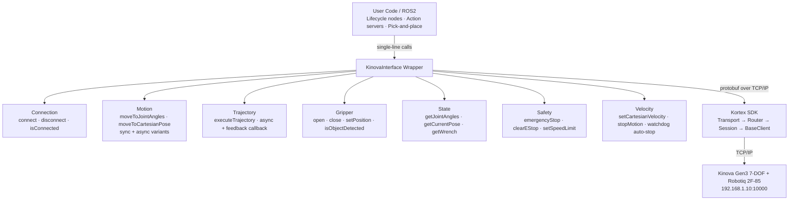
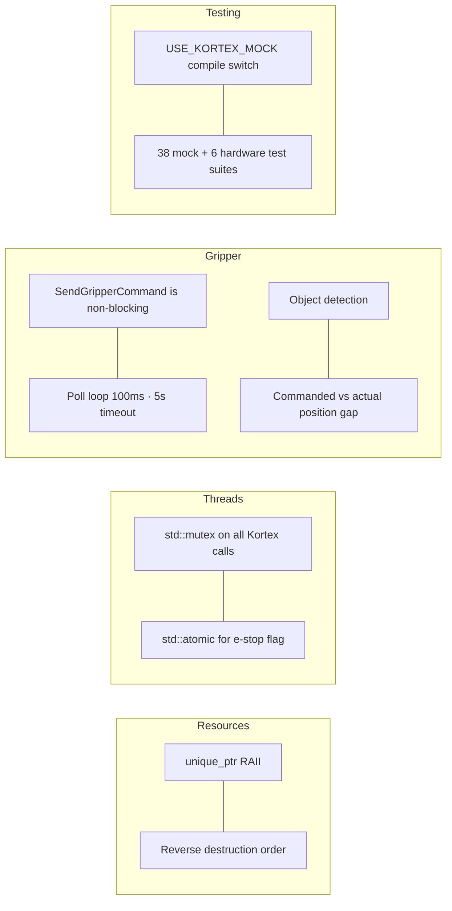

# KinovaInterface

A production-grade C++ wrapper around the Kinova Kortex API for the Gen3 7-DOF robotic arm with Robotiq 2F-85 gripper. Built with modern C++17 patterns (RAII, smart pointers, thread safety) and designed as the control foundation for a visual servoing pick-and-place capstone.

## The Problem

The Kortex SDK is powerful but requires significant boilerplate for every operation. A simple "connect and move" sequence looks like this:

```cpp
// Raw Kortex: ~60 lines for a single motion command
auto* transport = new TransportClientTcp();
transport->connect("192.168.1.10", 10000);
auto* router = new RouterClient(transport, [](auto err){ /* error cb */ });
auto* session_mgr = new SessionManager(router);
auto session_info = Session::CreateSessionInfo();
session_info.set_username("admin");
session_info.set_password("admin");
session_mgr->CreateSession(session_info);
auto* base = new Base::BaseClient(router);

// Build protobuf action (another 15+ lines)
Base::Action action;
auto* angles = action.mutable_reach_joint_angles()->mutable_joint_angles();
for (int i = 0; i < 7; i++) {
    auto* j = angles->add_joint_angles();
    j->set_joint_identifier(i);
    j->set_value(target[i]);
}
auto mode = Base::ServoingModeInformation();
mode.set_servoing_mode(Base::ServoingMode::SINGLE_LEVEL_SERVOING);
base->SetServoingMode(mode);
base->ExecuteAction(action);

// Manual cleanup — leaks if any step above throws
delete base;
delete session_mgr;
delete router;
transport->disconnect();
delete transport;
```

Every project repeats this. Errors are silently ignored. Resources leak on exceptions. Credentials are hardcoded. There is no thread safety, no input validation, and no way to test without hardware.

## The Solution

```cpp
KinovaInterface kinova;
kinova.connect("192.168.1.10");
kinova.moveToJointAngles({0, 0.26, 0, -1.05, 0, -0.78, 0});
kinova.closeGripper(40.0);

if (kinova.isObjectDetected()) {
    // object grasped — proceed with lift
}
// destructor auto-cleans everything, even on exceptions
```

Three lines replace sixty. Resources are managed automatically via RAII. Every call is thread-safe, input-validated, and covered by 25 automated tests.

## Architecture



## Key Design Decisions



> **Units:** Radians in public API · Degrees internally (Kortex convention) · Conversion at API boundary

## Dependencies

- g++ with C++17 support
- CMake 3.16+
- Google Test (`sudo apt install libgtest-dev cmake`)

## Project Structure

```
wrapper/
├── include/kinova_interface/
│   ├── KinovaInterface.hpp
│   └── Pose.hpp
├── mock/
│   └── kortex_mock.hpp
├── src/
│   └── KinovaInterface.cpp
├── tests/
│   ├── test_connection.cpp       # 4 tests (mock)
│   ├── test_motion.cpp           # 7 tests (mock)
│   ├── gripper_test.cpp          # 14 tests (mock)
│   ├── TrajectoryTest.cpp        # 8 tests (mock)
│   ├── test_velocity.cpp         # 5 tests (mock)
│   └── hardware/
│       ├── test_hw_connection.cpp # Real robot connect/disconnect
│       ├── test_hw_motion.cpp     # Joint motion on real arm
│       ├── test_hw_state.cpp      # State reading validation
│       ├── test_hw_gripper.cpp    # Robotiq open/close/detect
│       ├── test_hw_estop.cpp      # E-stop mid-motion
│       └── test_hw_fk_ik.cpp      # FK/IK vs Kortex validation
└── CMakeLists.txt
```

## Build

```bash
mkdir -p build && cd build
cmake .. -DUSE_KORTEX_MOCK=ON
make -j$(nproc)
```

## Run Tests

### Mock Tests (no hardware required)
./test_connection        # 4 tests
./test_motion            # 7 tests
./test_gripper           # 14 tests
./test_trajectory        # 8 tests
./test_velocity          # 5 tests

### Hardware Tests (real Gen3 required)
./hw_test_connection     # Connect/disconnect
./hw_test_motion         # Small joint motions
./hw_test_state          # Joint angle/pose reading
./hw_test_gripper        # Robotiq 2F-85 open/close/object detection
./hw_test_estop          # E-stop interrupts motion
./hw_test_fk_ik          # FK/IK validated against Kortex API

**38 mock tests passing. 6 hardware test suites validated on real Gen3.**


## API

```cpp

// Types
struct TrajectoryPoint {
    std::vector<double> joint_angles;  // radians
    double time_from_start;            // seconds
};

using MotionCallback = std::function<void(
    const std::vector<double>& current_joints, double progress)>;

// Connection
bool connect(const std::string& ip, uint32_t port = 10000);
void disconnect();
bool isConnected() const;

// Motion (angles in radians)
bool moveToJointAngles(const std::vector<double>& angles);
std::future<bool> moveToJointAnglesAsync(const std::vector<double>& angles);
bool moveToCartesianPose(const Pose& pose);
std::future<bool> moveToCartesianPoseAsync(const Pose& pose);

// Gripper (Robotiq 2F-85)
bool openGripper(double speed = 0.1);
bool closeGripper(double force = 40.0, double speed = 0.1);
bool setGripperPosition(double position, double speed = 0.1);  // 0.0=open, 1.0=closed
double getGripperPosition();                                     // returns -1.0 on failure
bool isObjectDetected();                                         // stall-based detection

// State
std::vector<double> getJointAngles();
Pose getCurrentPose();
std::vector<double> getWrench();  // [Fx, Fy, Fz, Tx, Ty, Tz]

// Safety
void emergencyStop();
bool isEStopActive() const;
bool clearEmergencyStop();
bool setSpeedLimit(double fraction);  // 0.0 to 1.0

// Trajectory
bool executeTrajectory(const std::vector<TrajectoryPoint>& waypoints,
                       MotionCallback feedback_cb = nullptr);
std::future<bool> executeTrajectoryAsync(const std::vector<TrajectoryPoint>& waypoints,
                                          MotionCallback feedback_cb = nullptr);

// Velocity Control
bool setCartesianVelocity(double vx, double vy, double vz,    // m/s
                          double wx, double wy, double wz);    // deg/s
void stopMotion();                                              // zero velocity, arm stays powered
bool isVelocityActive() const;                                  // true if in velocity mode
```


## ROS2 Integration

The wrapper is consumed by `KinovaLifecycleController`, a ROS2 lifecycle node providing:
- Joint state publishing at 10 Hz (`/joint_states`)
- `MoveToPose` action server (`/kinova/move_to_pose`) with feedback and cancellation
- Controlled startup/shutdown via lifecycle transitions (configure → activate → deactivate → cleanup)
- Component-based architecture loaded into a shared container for efficient resource usage

## Hardware

| Component | Model | Interface |
|-----------|-------|-----------|
| Arm | Kinova Gen3 7-DOF | TCP/IP via Kortex SDK |
| Gripper | Robotiq 2F-85 | Via Kortex `SendGripperCommand` (internal interconnect) |
| Camera | Intel RealSense D435i | Wrist-mounted, ROS2 integration Week 5 |
| OS | Ubuntu 24.04 | ROS2 Jazzy |

## Roadmap

- [x] Connection management (RAII, auto-cleanup, reconnection)
- [x] Joint and Cartesian motion (sync + async)
- [x] Emergency stop + joint limit validation
- [x] Gripper control (position, open/close, object detection)
- [x] Trajectory execution — multi-waypoint with progress callback
- [x] ROS2 lifecycle node + action server + component architecture
- [x] 38 Google Tests (connection, motion, gripper, trajectory, velocity)
- [x] Hardware validated — 6 test suites on real Gen3
- [x] FK/IK validated against Kortex API (error < 6mm)
- [x] Cartesian velocity control — three-layer safety (clamping, workspace boundary, watchdog auto-stop)
- [x] Admittance controller integration — 6-DOF force/torque compliant motion
- [x] Surface wiping demo — PI force control maintaining 5N contact at 0.02 m/s
- [ ] Perception pipeline — YOLOv8 + FoundationPose via built-in RealSense (Week 5-8)
- [ ] RL sim-to-real — MuJoCo SAC training → ONNX deployment (Week 9-12)
- [ ] Visual servoing capstone — programmatic + RL pick-and-place (Week 13-16)
## Velocity Control

Cartesian velocity commands with three-layer safety:
- **Clamping**: Linear velocities capped at ±0.5 m/s, angular at ±40 deg/s
- **Workspace boundary**: Per-axis check prevents EE from leaving safe volume; motion away from boundary always allowed
- **Watchdog**: Background thread auto-stops arm if no command received within 100ms (control loop crash protection)

```cpp
// Move end-effector: +X at 0.1 m/s, slowly descending
kinova.setCartesianVelocity(0.1, 0.0, -0.05, 0.0, 0.0, 0.0);
std::this_thread::sleep_for(std::chrono::seconds(2));
kinova.stopMotion();  // arm stops, stays powered — no e-stop clearing needed
```

**Measured performance:** `SendTwistCommand()` blocks for ~73ms per call (gRPC
round-trip to the arm's internal controller). This caps real-time velocity loops
at ~13 Hz through the high-level API. Kinova documents 40 Hz max. Adequate for
admittance control and surface wiping (1.5 mm per update at 20 mm/s). Upgrade
path: Kortex low-level servoing API (1 kHz, joint-space commands).

## Known Issues

**High-level API loop rate (~13 Hz):** `SendTwistCommand()` takes ~73ms (gRPC
round-trip). This is a Kortex SDK architectural limitation, not a bug. All
math and state reads combined take <1ms — the API call is the sole bottleneck.
Adequate for admittance control and surface wiping; visual servoing will require
migration to low-level servoing (1 kHz, joint-space).

**`bad_function_call` on activation (Kortex SDK):** A single message prints to stderr after connecting to the real Gen3. Originates from a closed-source SDK internal thread. No functional impact — joint data publishes, all transitions succeed. Cannot be patched.
